---

## Sobre mim

### Português

Sou **Fullstack Developer** com experiência na integração entre tecnologia, engenharia, planejamento e inteligência de dados. Atuo em diferentes camadas da indústria, desde o planejamento e controle de unidades industriais até os níveis gerencial e corporativo.

Minha experiência está concentrada principalmente nos segmentos de **papel e celulose, mineração e siderurgia**, com foco em planejamento, gestão de projetos, indicadores, automação de processos e integração entre soluções como **Oracle Primavera P6, Microsoft Project, Power BI e sistemas corporativos**.

Transformo processos complexos em soluções digitais mais claras, conectadas e orientadas à tomada de decisão.

### English

I am a **Fullstack Developer** with experience connecting technology, engineering, planning and data intelligence. I work across multiple industrial layers, from unit planning and project control to management and corporate environments.

My background is mainly focused on the **pulp and paper, mining and steel industries**, with an emphasis on planning, project management, performance indicators, process automation and integrations involving **Oracle Primavera P6, Microsoft Project, Power BI and corporate systems**.

I transform complex processes into clearer, connected and decision-oriented digital solutions.

---

## Stack tecnológica

Minha atuação envolve desenvolvimento fullstack, criação de aplicações, automações, visualizações de dados, desenvolvimento de soluções para Power BI e construção de ferramentas para apoiar processos industriais e corporativos.

Também trabalho com integração de dados, indicadores de desempenho, planejamento de projetos, estruturas analíticas, gestão de portfólio e soluções relacionadas ao Primavera P6, Microsoft Project e Power BI.

---

## Portfólio em números

O portfólio reúne **56 repositórios**, distribuídos entre aplicações, soluções de Business Intelligence, websites e automações. Os projetos combinam desenvolvimento web, Python, DAX, visualização de dados, planejamento e digitalização de processos.

---

## Principais áreas de desenvolvimento

`Fullstack Development` &nbsp; `Business Intelligence` &nbsp; `Power BI` &nbsp; `DAX`

`Process Automation` &nbsp; `Industrial Planning` &nbsp; `Project Management`

`Primavera P6` &nbsp; `Microsoft Project` &nbsp; `Data Visualization`

---

## Repositórios

Os repositórios estão organizados em diferentes frentes, incluindo aplicações web, projetos experimentais, ferramentas para Power BI, automações, soluções para planejamento e projetos voltados à medição, controle e acompanhamento de empreendimentos industriais.

Acesse o [meu perfil no GitHub](https://github.com/felipehbortolini) para explorar os projetos disponíveis.

---

## Vamos conectar tecnologia e indústria

Desenvolvo soluções que aproximam dados, pessoas e processos, criando uma ponte entre a operação industrial e a tomada de decisão estratégica.

